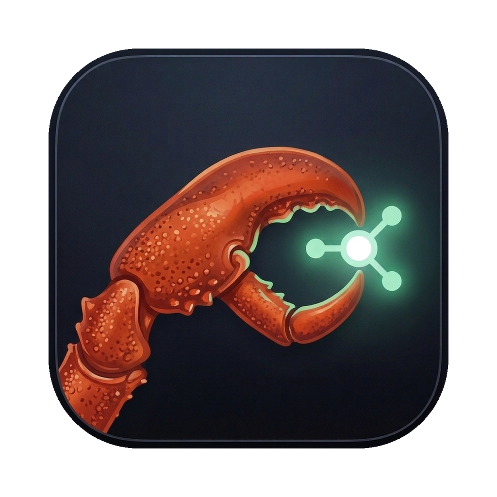

<p align="center">
  
</p>

<h1 align="center">OpenClaw Connector</h1>

<p align="center">
  <strong>Securely bridge remote AI agents to your local machine</strong>
</p>

<p align="center">
  <a href="#features">Features</a> •
  <a href="#quick-start">Quick Start</a> •
  <a href="#installation">Installation</a> •
  <a href="docs/guide.md">User Guide</a> •
  <a href="#contributing">Contributing</a>
</p>

<p align="center">
  
  
  
  
  <a href="https://github.com/liuzeming-yuxi/Openclaw-Connector/releases"></a>
  <a href="LICENSE"></a>
</p>

<p align="center">
  <a href="README.zh-CN.md">简体中文</a> | English
</p>

---


## Why OpenClaw Connector?

[OpenClaw](https://github.com/openclaw/openclaw) agents run on your server, but often need to interact with your **local environment** — running commands, controlling browsers, accessing local files.

OpenClaw Connector solves two problems:

1. **Bridging server and local** — It creates a secure tunnel between OpenClaw agents and your local machine, so agents can execute tasks on your computer as if they were sitting next to you.

2. **Secure gateway access** — The OpenClaw gateway should never be exposed to the public internet. This app lets you access it securely from your local machine through an encrypted SSH tunnel — no open ports, no public URLs.

## Features

- **SSH Tunnel** — Secure reverse tunnel to your Linux gateway with auto-reconnect
- **Agent Bindings** — Bind AI agents to your local node for remote task execution
- **Browser CDP** — Expose local Chrome browser to agents via Chrome DevTools Protocol
- **Session Management** — Notify agents across chat sessions with one click
- **Device Identity** — Ed25519 keypair for secure device authentication
- **Emergency Disconnect** — One-click kill switch to instantly sever all connections

## Installation

Download the latest release for your platform from the [Releases](https://github.com/liuzeming-yuxi/Openclaw-Connector/releases) page.

| Platform | File |
|----------|------|
| **macOS (Apple Silicon)** | `OpenClaw.Connector_x.x.x_aarch64.dmg` |
| **macOS (Intel)** | `OpenClaw.Connector_x.x.x_x64.dmg` |
| **Linux (Debian/Ubuntu)** | `OpenClaw.Connector_x.x.x_amd64.deb` |
| **Linux (AppImage)** | `OpenClaw.Connector_x.x.x_amd64.AppImage` |
| **Windows** | `OpenClaw.Connector_x.x.x_x64-setup.exe` |

> **macOS note:** On first launch, macOS may show "cannot verify developer". Go to **System Settings → Privacy & Security**, scroll down and click **"Open Anyway"**.
>
> **Linux AppImage:** Run `chmod +x OpenClaw.Connector_*.AppImage` first.

## Quick Start

### Prerequisites

- A running [OpenClaw](https://github.com/openclaw/openclaw) gateway on a remote Linux server
- SSH access to the server from your local machine

> **New to OpenClaw?** See the [User Guide](docs/guide.md) for detailed setup instructions and parameter explanations.

### Build from Source

```bash
# Clone the repo
git clone https://github.com/liuzeming-yuxi/Openclaw-Connector.git
cd Openclaw-Connector

# Install dependencies (requires Node.js 18+, pnpm, Rust toolchain)
pnpm install

# Run in development mode
pnpm tauri dev

# Or build for production
pnpm tauri build
```

## Tech Stack

| Layer | Technology |
|-------|-----------|
| Desktop Framework | [Tauri 2](https://v2.tauri.app/) |
| Frontend | React 19 + TypeScript + Tailwind CSS 4 |
| State Management | Zustand 5 |
| Backend | Rust (Tokio async runtime) |
| Tunnel | SSH reverse port forwarding |
| Browser Automation | Chrome DevTools Protocol (CDP) |

## Project Structure

```
├── src/                    # React frontend
│   ├── pages/              # Page components
│   ├── components/ui/      # Reusable UI components
│   ├── store/              # Zustand state stores
│   └── types/              # TypeScript type definitions
├── src-tauri/              # Rust backend
│   └── src/
│       ├── lib.rs          # Tauri command handlers
│       ├── ssh_tunnel.rs   # SSH tunnel management
│       ├── browser.rs      # Chrome CDP lifecycle
│       ├── ws_client.rs    # WebSocket client
│       ├── config.rs       # Configuration persistence
│       ├── health.rs       # Gateway health monitoring
│       └── device_identity.rs  # Ed25519 device keys
├── docs/                   # Documentation
└── package.json
```

## Development

```bash
# Run frontend + backend in dev mode
pnpm tauri dev

# Run frontend tests
pnpm test

# Run Rust tests
cargo test --manifest-path src-tauri/Cargo.toml

# Type check
pnpm build
```

## Roadmap

- [ ] Cross-platform support (Windows & Linux)
- [ ] Multi-language UI (i18n)
- [ ] Theme switching (Light / Dark mode)
- [ ] OpenClaw health check & auto-repair
- [ ] Browser automation beyond Chrome (Firefox, Edge, etc.)
- [ ] Comprehensive CI/CD pipeline
- [x] PR-level CI checks (lint, test, clippy)
- [ ] Architecture / sequence diagram
- [x] Safer port management (avoid killing unrelated processes)
- [x] Operator WebSocket graceful shutdown on disconnect
- [x] Unified config source of truth (frontend vs backend)

## Star History

<p align="center">
  <a href="https://star-history.com/#liuzeming-yuxi/Openclaw-Connector&Date">
    
  </a>
</p>

## Acknowledgments

OpenClaw Connector is built on excellent open-source projects:

- [OpenClaw](https://github.com/openclaw/openclaw) — The AI agent runtime
- [Tauri](https://v2.tauri.app/) — Lightweight desktop framework
- [React](https://react.dev/) — UI component library
- [Zustand](https://github.com/pmndrs/zustand) — Lightweight state management
- [Tailwind CSS](https://tailwindcss.com/) — Utility-first CSS framework
- [Lucide](https://lucide.dev/) — Beautiful icon set

## Contributing

See [CONTRIBUTING.md](CONTRIBUTING.md) for guidelines.

## Security

See [SECURITY.md](SECURITY.md) for the security model and vulnerability reporting.

## License

[MIT](LICENSE)
