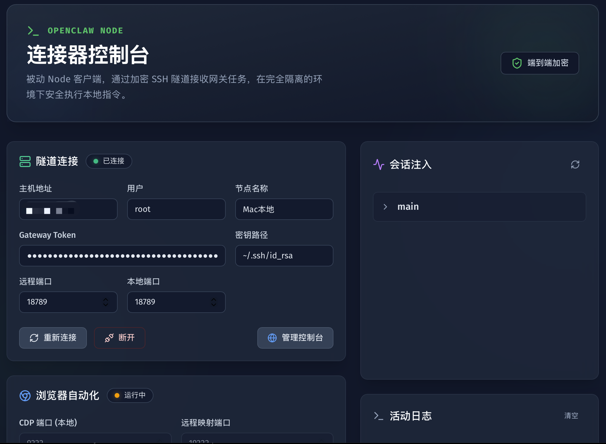

# OpenClaw Connector

[English](README.md) | 简体中文

一款 macOS 桌面应用，通过 SSH 隧道将本地机器连接到 [OpenClaw](https://github.com/openclaw/openclaw) 网关，让 AI Agent 能够与你的本地环境交互。



## 功能特性

- **SSH 隧道** — 安全的反向隧道连接到 Linux 网关，支持自动重连
- **Agent 绑定** — 将 AI Agent 绑定到本地节点，执行远程任务
- **浏览器 CDP** — 通过 Chrome DevTools Protocol 将本地浏览器暴露给 Agent
- **会话管理** — 一键通知多个聊天会话中的 Agent
- **设备身份** — Ed25519 密钥对，用于安全的设备认证
- **紧急断开** — 一键断开所有连接的紧急开关

## 快速开始

### 前置要求

- **macOS** 12+
- **Node.js** 18+ 和 [pnpm](https://pnpm.io/)
- **Rust** 工具链 ([rustup](https://rustup.rs/))
- 一台运行 OpenClaw 网关的远程 Linux 服务器

### 安装与运行

```bash
# 克隆仓库
git clone https://github.com/liuzeming-yuxi/Openclaw-Connector.git
cd Openclaw-Connector

# 安装依赖
pnpm install

# 开发模式运行
pnpm tauri dev
```

### 生产构建

```bash
pnpm tauri build
```

`.dmg` 安装包会生成在 `src-tauri/target/release/bundle/dmg/` 目录下。

## 技术栈

| 层级 | 技术 |
|------|-----|
| 桌面框架 | [Tauri 2](https://v2.tauri.app/) |
| 前端 | React 19 + TypeScript + Tailwind CSS 4 |
| 状态管理 | Zustand 5 |
| 后端 | Rust (Tokio 异步运行时) |
| 隧道 | SSH 反向端口转发 |
| 浏览器自动化 | Chrome DevTools Protocol (CDP) |

## 项目结构

```
├── src/                    # React 前端
│   ├── pages/              # 页面组件
│   ├── components/ui/      # 可复用 UI 组件
│   ├── store/              # Zustand 状态管理
│   └── types/              # TypeScript 类型定义
├── src-tauri/              # Rust 后端
│   └── src/
│       ├── lib.rs          # Tauri 命令处理
│       ├── ssh_tunnel.rs   # SSH 隧道管理
│       ├── browser.rs      # Chrome CDP 生命周期
│       ├── ws_client.rs    # WebSocket 客户端
│       ├── config.rs       # 配置持久化
│       ├── health.rs       # 网关健康监控
│       └── device_identity.rs  # Ed25519 设备密钥
├── docs/                   # 文档
└── package.json
```

## 开发指南

```bash
# 开发模式运行（前端 + 后端）
pnpm tauri dev

# 运行前端测试
pnpm test

# 运行 Rust 测试
cargo test --manifest-path src-tauri/Cargo.toml

# 类型检查
pnpm build
```

## 贡献

请参阅 [CONTRIBUTING.zh-CN.md](CONTRIBUTING.zh-CN.md)。

## 许可证

[MIT](LICENSE)
